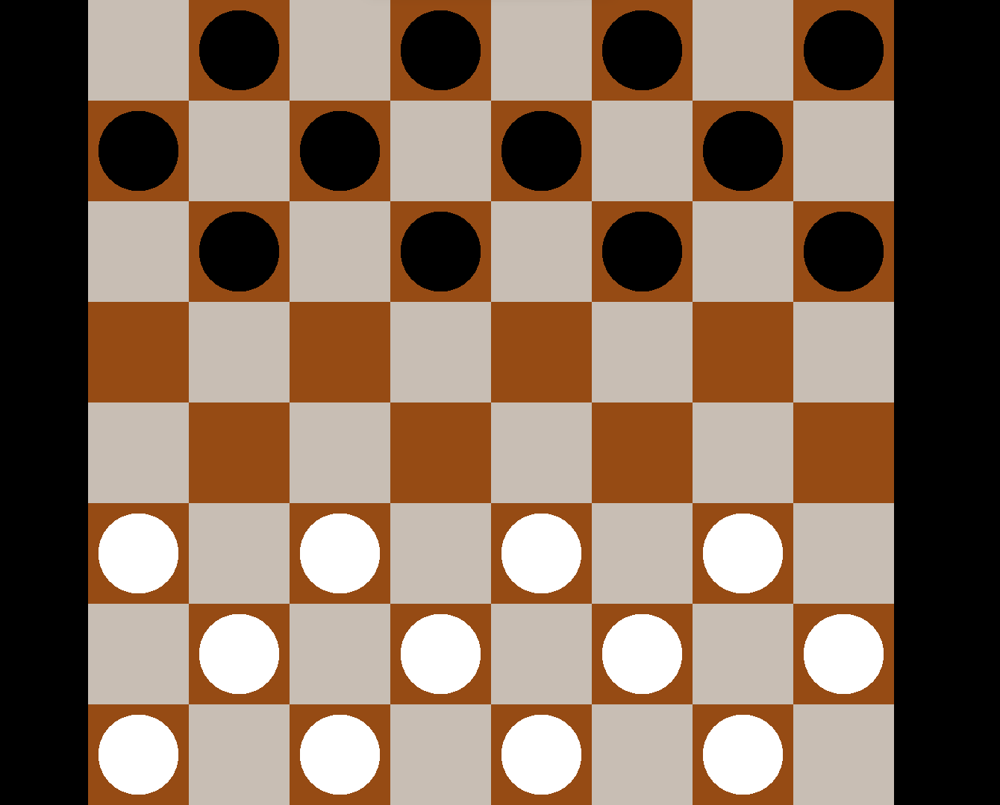
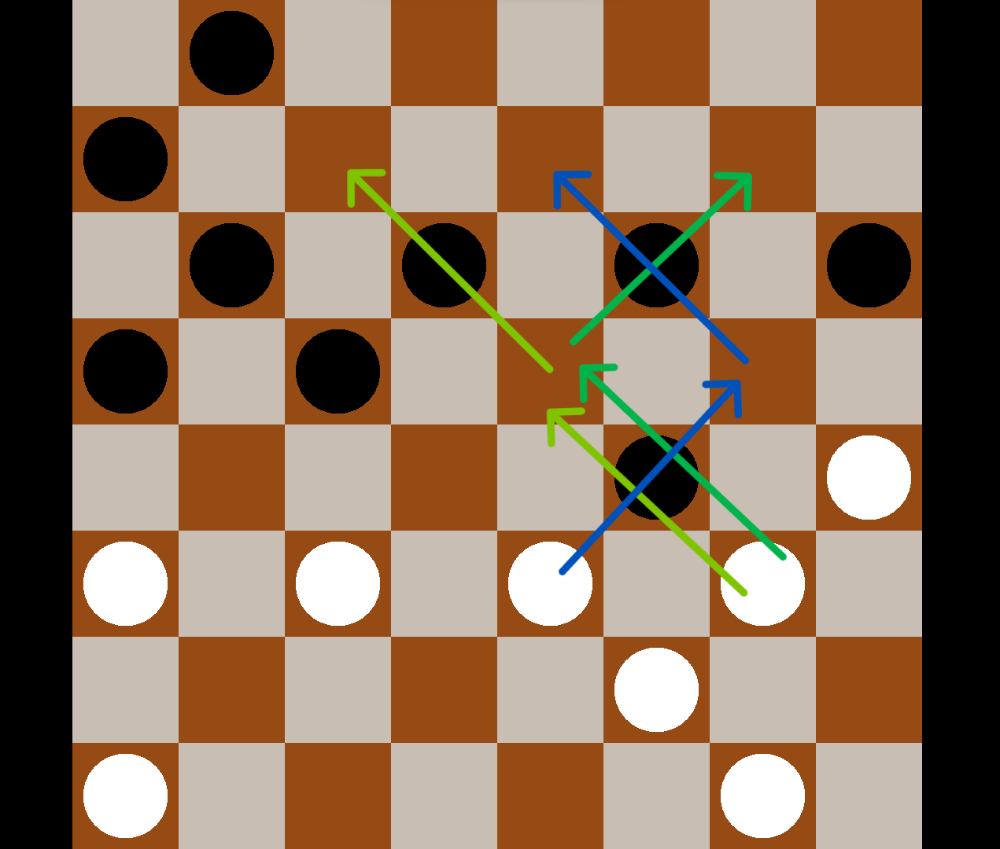
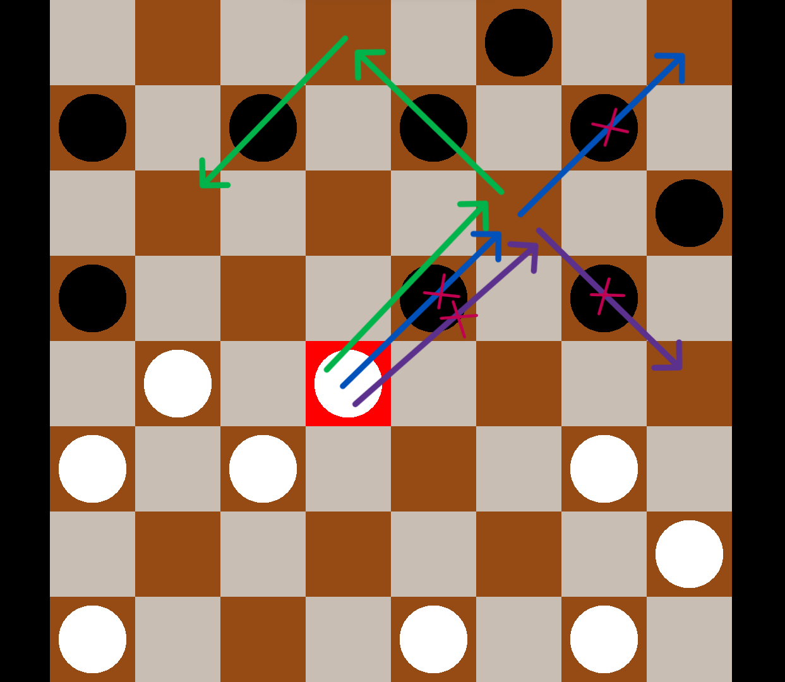
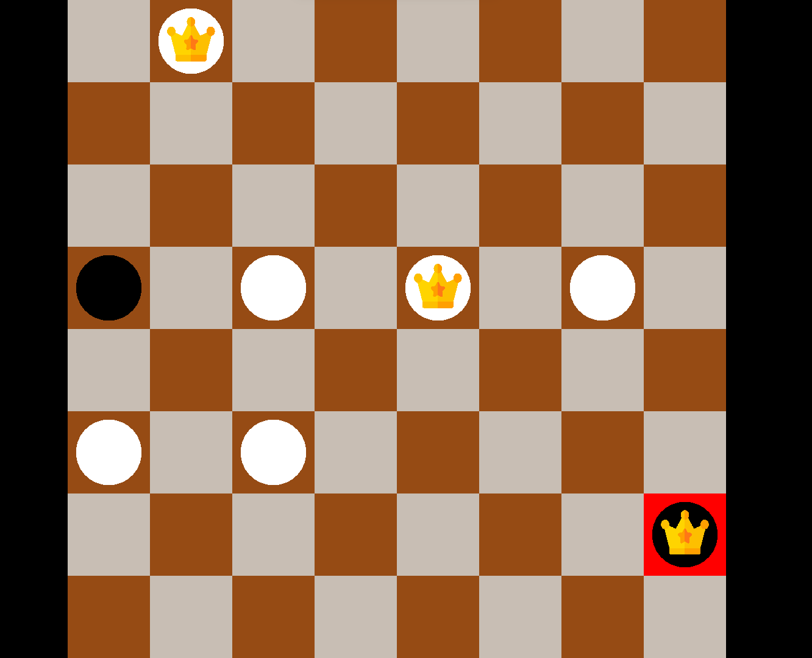

# Checkers
It's standard game of checkers for two players. 

## Descriprion
You move in truns with another player trying to capture all opponent's pawns. If oponent doesn't have any pawns or he can't make any moves you win.
The game analyzes all possible moves and doesn't let you do the incorrect ones. if you wish to quit the game press **ESC** button.

## Some examples
**1. Initial state.**

**2. Examples with legal moves which are analyzed by the algorithm. (You always have to choose the move with the most captures)**

   
