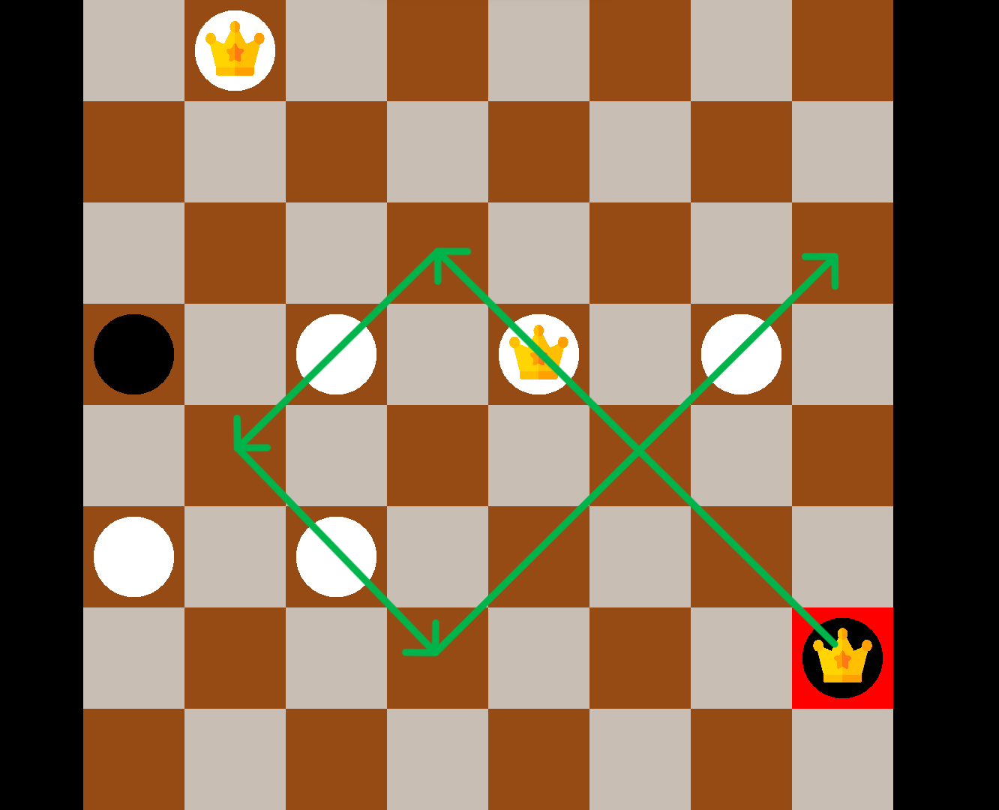

# Checkers
It's standard game of checkers for two players. 

## Descriprion
You move in truns with another player trying to capture all opponent's pawns. If oponent doesn't have any pawns or he can't make any move you win.
The game analyzes all possible moves and doesn't let you to do the incorrect ones.

## Some examples
**1. Initial state**

**2. Examples with leggal moves which are analyzed by the algorithm**

  
